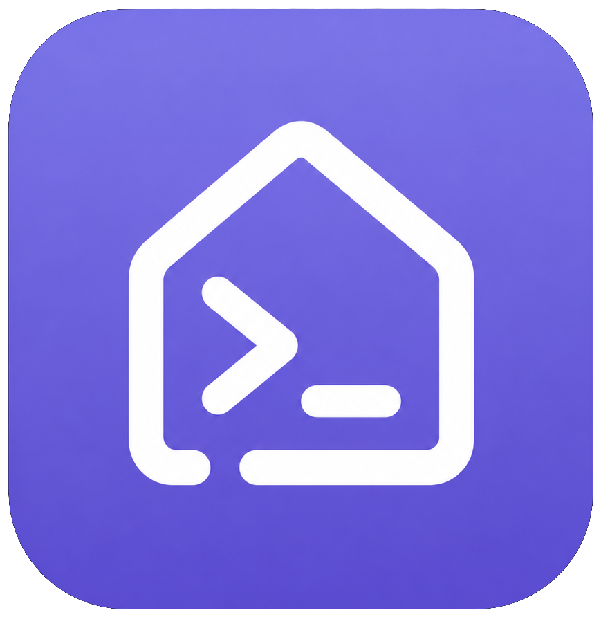
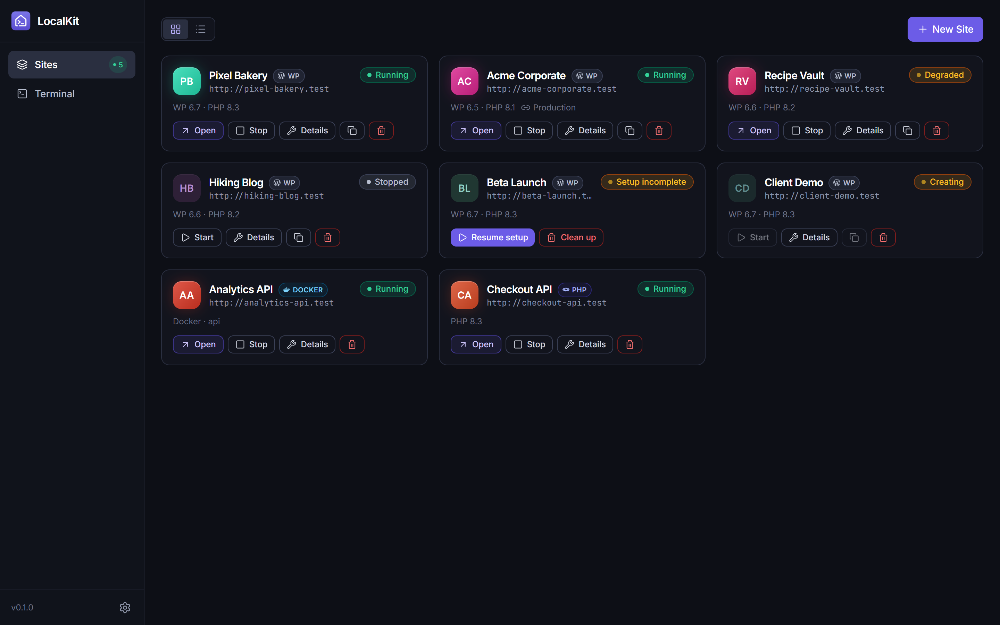
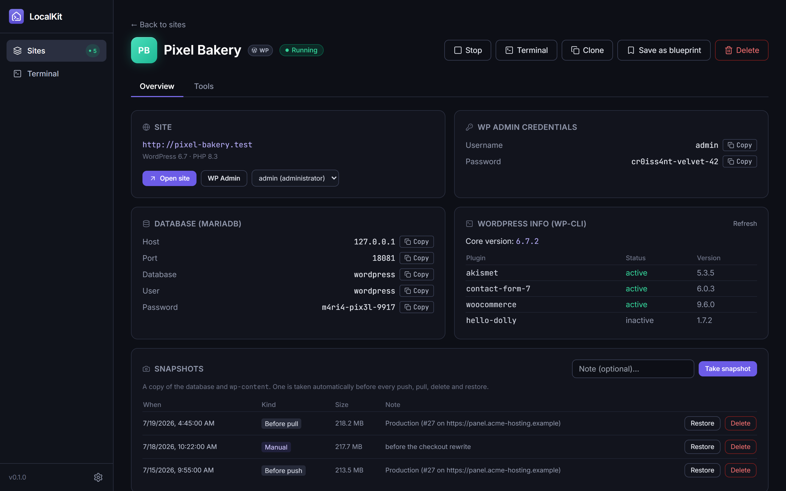
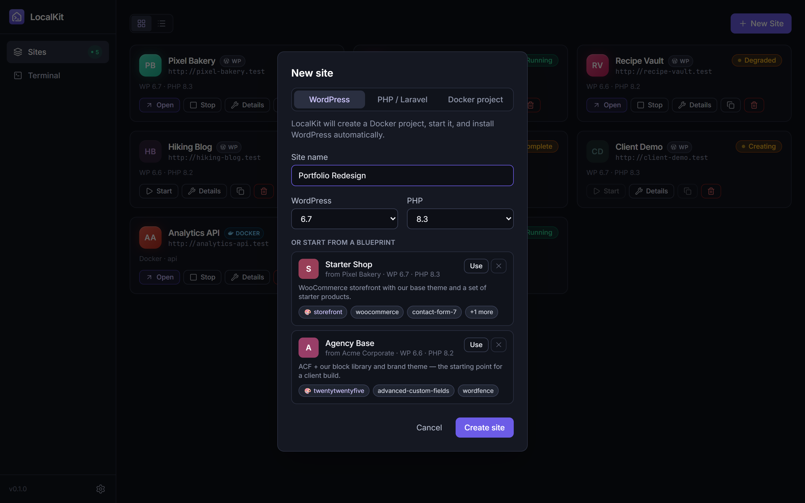
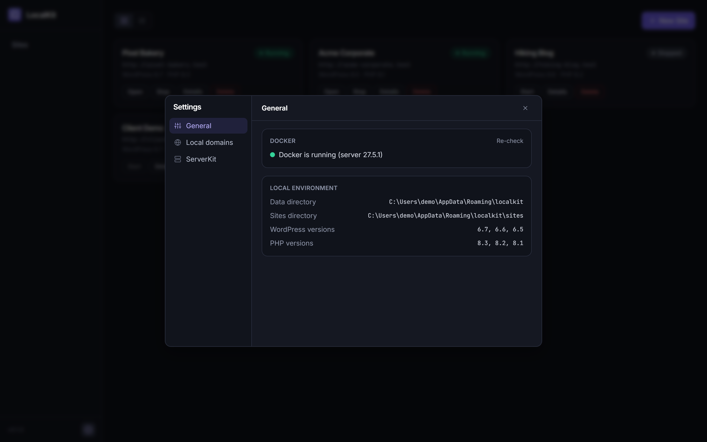

<div align="center">



# LocalKit

**Spin up local WordPress sites in one click — each site an isolated Docker Compose project.**

[](https://github.com/jhd3197/localkit/releases)
[](LICENSE)
[](https://tauri.app)

*Local WordPress development, without the bloat.*

</div>

---

## What it is

LocalKit is a desktop app (think LocalWP, but leaner) that runs each WordPress site as its own Docker Compose project — WordPress + MariaDB, with `wp-content` bind-mounted to a plain host folder so you can edit code in your own editor. Pick a name, a WordPress version and a PHP version; LocalKit writes the compose files, boots the containers, installs WordPress via wp-cli, and hands you the admin credentials.

v1 is milestones M1–M3 of the [roadmap](docs/plans/ROADMAP.md): local sites plus a read-only [ServerKit](https://github.com/) connection. Later milestones push and pull sites to servers through a ServerKit API extension (`serverkit-localkit`).

<!-- LOCALKIT:SHOTS:START -->
## 📸 Screenshots

> Captured from a mock-data build — every site, credential, and server below is fictional. See [`docs/screenshots/CAPTURE.md`](docs/screenshots/CAPTURE.md) for the shot list and how to regenerate them with `npm run shots`.

<details open>
<summary><strong>Dashboard</strong> — all your sites at a glance, with live container status badges</summary>



</details>

<details>
<summary><strong>Site detail</strong> — open site / wp-admin, copyable admin &amp; DB credentials, wp-cli info</summary>



</details>

<details>
<summary><strong>New site</strong> — pick a name, WordPress version, and PHP version</summary>



</details>

<details>
<summary><strong>Settings</strong> — Docker status, data paths, and read-only ServerKit connections</summary>



</details>
<!-- LOCALKIT:SHOTS:END -->

## ✨ Features (v1)

- **One-click WordPress sites** — name, WP version, PHP version, done
- **Per-site Docker Compose project** — `wordpress:<wp>-php<php>-apache` + `mariadb:11`
- **Automatic WordPress install** via wp-cli, with generated admin credentials
- **Unique host ports per site** — sites on `http://localhost:8081+`, DB on `18081+`
- **Start / stop / delete**, live container status badges, container log viewer
- **Site detail page** — open site / wp-admin, copyable admin + DB credentials, wp-cli info (core version, plugins)
- **ServerKit connections (read-only)** — save/test/delete server connections and browse their remote WordPress sites

## Requirements

- **Docker Desktop** (running) with Compose v2+
- **Node.js 20+** and **Rust** (stable, MSVC toolchain on Windows)

## Develop

```bash
npm install
npm run tauri dev        # starts Vite + the Tauri window
```

Frontend only (for UI iteration without the shell):

```bash
npm run dev              # Vite on http://localhost:1420
npm run build            # tsc + vite build
```

Rust backend:

```bash
cd src-tauri
cargo check
cargo build
```

> **Windows note:** if `cargo` on your PATH is a non-rustup GNU install
> (e.g. from chocolatey) and you hit `dlltool.exe: program not found`,
> put the rustup shims first: `export PATH="$HOME/.cargo/bin:$PATH"`
> (or use `rustup run stable cargo check`).

## Production build

```bash
npm run tauri build
```

## Architecture

```
React frontend (Zustand stores)
        │  invoke / events
        ▼
Tauri commands (src-tauri/src/lib.rs)
        │
        ├─► SQLite (rusqlite, forward-only migrations)
        ├─► docker compose CLI  ──► per-site project dir (compose + .env + wp-content/)
        └─► ServerKit API (reqwest, X-API-Key)
```

The backend shells out to the `docker compose` CLI — no Docker API client, no admin rights needed. Long operations stream `site-event` progress events (`files → containers → waiting → install → done`) to the UI.

## Layout

```
src/                     React 18 + TS + Vite frontend
  lib/ipc.ts             typed wrappers for all Tauri commands (invoke + events)
  lib/types.ts           shared TS types mirroring Rust payloads
  stores/                Zustand stores (nav, sites)
  pages/                 Dashboard, SiteDetail, Settings
  components/            Sidebar, StatusBadge, CopyButton, NewSiteDialog
  mock/                  fake invoke/listen data for `vite --mode mock` (screenshots)
src-tauri/               Rust backend
  src/lib.rs             AppState, command registration, app entry
  src/db.rs              rusqlite, forward-only migrations (PRAGMA user_version)
  src/docker.rs          `docker compose` CLI wrapper
  src/site.rs            Site model, lifecycle, compose/env templates
  src/wordpress.rs       wp-cli via `docker compose run --rm wpcli`
  src/serverkit.rs       read-only ServerKit API client
scripts/                 capture-screenshots.mjs (npm run shots)
docs/
  plans/                 ROADMAP.md + numbered implementation plans
  screenshots/           README screenshots + CAPTURE.md
```

## Where things live

- App data: `%APPDATA%/LocalKit/` (macOS: `~/Library/Application Support/LocalKit/`, Linux: `~/.local/share/LocalKit/`)
  - `localkit.db` — SQLite database of sites
  - `sites/<slug>/` — per-site project: `docker-compose.yml`, `.env`, `wp-content/` (edit your code here)

## ServerKit connection notes

- Auth is via `X-API-Key` (create a key in ServerKit → API settings).
- Connection test = public `/api/v1/system/health` + key validation against `/api/v1/setup-health/account`.
- API keys are stored in **plaintext** in LocalKit's local SQLite DB — accepted for v1, keyring storage is on the roadmap.
- Listing remote WP sites calls `/api/v1/wordpress/sites`, which is JWT-only in ServerKit today; LocalKit shows a clear message until the `serverkit-localkit` extension (M4) lands.

## Tech stack

Tauri 2 (Rust) · React 18 + TypeScript + Vite · Tailwind CSS v3 · Zustand · rusqlite (bundled SQLite) · reqwest (rustls)

## 🗺️ Roadmap

- **M1 — Local site lifecycle** ✅ create/start/stop/delete, compose projects, port allocation
- **M2 — WordPress install & detail** ✅ wp-cli install, credentials, logs, wp info
- **M3 — ServerKit read-only connection** ✅ save/test connections, browse remote sites
- **M4 — Push / pull to servers** ⬜ via the `serverkit-localkit` ServerKit extension
- **M5 — Release polish** ⬜ installers, auto-update, OS keyring for API keys, test suite

Full details, per-plan phases, and build order: [`docs/plans/ROADMAP.md`](docs/plans/ROADMAP.md).

## License

MIT — see [LICENSE](LICENSE).
