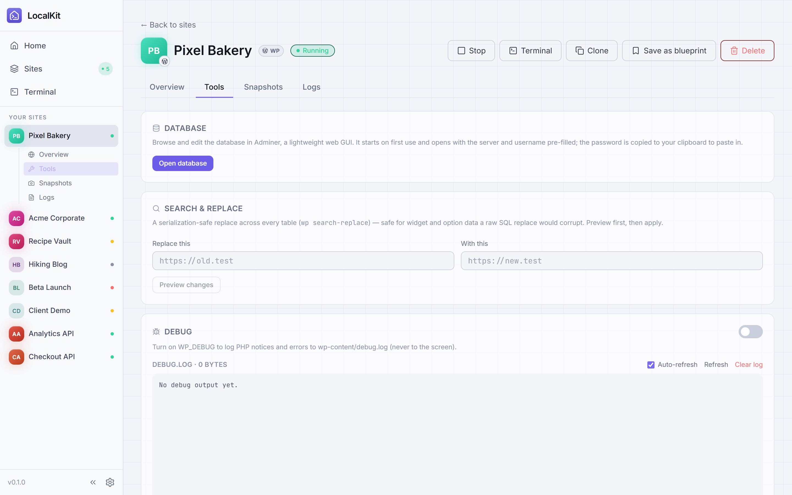
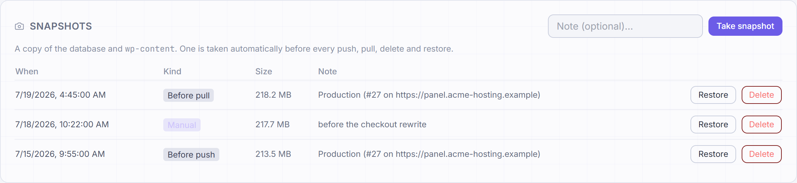
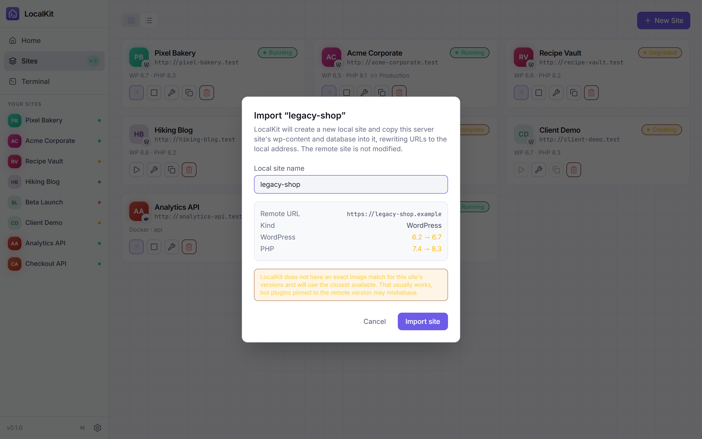
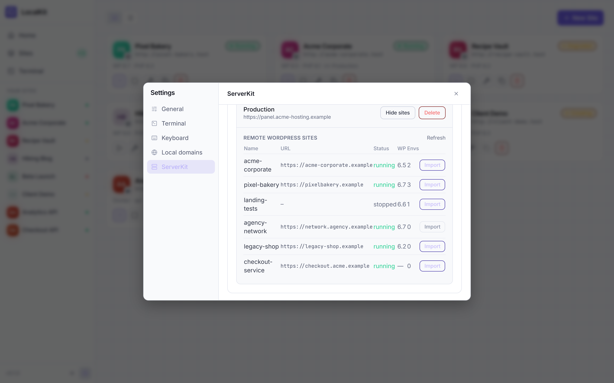

<div align="center">


# LocalKit

**Levanta sitios WordPress locales en un clic.**

Una aplicación de escritorio ligera (piensa en LocalWP, pero más liviana) que ejecuta cada sitio WordPress
como su propio proyecto aislado de Docker Compose — con `wp-content` montado en
una carpeta normal del host, para que edites el código en tu propio editor.

[English](../README.md) | Español | [中文版](README.zh-CN.md) | [Português](README.pt.md)

<br>


[](https://discord.gg/ZKk6tkCQfG)

[](https://github.com/jhd3197/LocalKit/stargazers)
[](https://github.com/jhd3197/LocalKit/releases)
[](../LICENSE)
[](https://github.com/jhd3197/LocalKit/releases)
[](https://tauri.app)
[](https://reactjs.org)

<br>

[Inicio Rápido](#-inicio-rápido) · [Capturas](#-capturas-de-pantalla) · [Funcionalidades](#-funcionalidades) · [Arquitectura](#-arquitectura) · [Hoja de Ruta](#-hoja-de-ruta) · [Documentación](#-documentación) · [Contribuir](#-contribuir) · [Discord](#-comunidad)

</div>

---

## 🚀 Inicio Rápido

> ⏱️ Del clonado a un sitio WordPress funcionando en minutos

### Requisitos

- **Docker Desktop** (en ejecución) con Compose v2+
- **Node.js 20+** y **Rust** (estable, toolchain MSVC en Windows) — solo para compilar desde el código fuente
- Para la sincronización: un servidor **[ServerKit](https://github.com/jhd3197/ServerKit)** con la **extensión `serverkit-localkit`** instalada

### Desarrollo

```bash
git clone https://github.com/jhd3197/LocalKit.git
cd LocalKit
npm install
npm run tauri dev        # inicia Vite + la ventana de Tauri
```

### Compilación de producción

```bash
npm run tauri build
```

<!-- LOCALKIT:SHOTS:START -->
## 📸 Capturas de Pantalla

> Capturadas desde una compilación con datos ficticios — todos los sitios, credenciales y servidores que se ven a continuación son inventados. Consulta [`docs/screenshots/CAPTURE.md`](screenshots/CAPTURE.md) para la lista de capturas y cómo regenerarlas con `npm run shots`.

|                            Panel Principal                             |                            Vista de Lista                            |
| :--------------------------------------------------------------: | :------------------------------------------------------------: |
|             |             |
|   _Todos tus sitios de un vistazo — WordPress, PHP y Docker — con insignias de estado en vivo_   |   _Una vista de tabla más densa para muchos sitios_   |

|                             Detalle del Sitio                              |                           Herramientas                            |
| :-------------------------------------------------------------: | :------------------------------------------------------------: |
|                  |           |
| _Credenciales, base de datos, información de wp-cli, snapshots y sincronización_ | _Explorador de BD Adminer, buscar-reemplazar seguro, WP\_DEBUG y editor de configuración — dentro de la app_ |

|                             Snapshots                             |                           Nuevo Sitio                            |
| :-------------------------------------------------------------: | :------------------------------------------------------------: |
|                  |           |
| _Restauración en un clic; se toma uno antes de cada push, pull y borrado_ | _WordPress, PHP/Laravel o un proyecto Docker — en blanco o desde un blueprint_ |

|                             Importar                             |                           Ajustes                            |
| :-------------------------------------------------------------: | :------------------------------------------------------------: |
|                  |           |
| _Clona un sitio remoto de ServerKit como una copia local nueva_ | _Estado de Docker, actualizaciones, rutas de datos y valores por defecto_ |

|                           Dominios Locales                            |                           ServerKit                           |
| :--------------------------------------------------------------: | :-------------------------------------------------------------: |
|                        |            |
|      _Sirve sitios como `http://<slug>.test` mediante un router Caddy compartido_      |     _Explora los sitios de un servidor y haz push/pull o impórtalos_     |
<!-- LOCALKIT:SHOTS:END -->

## 🎯 Funcionalidades

### 🚀 Sitios y Docker

| | |
|---|---|
| **Sitios WordPress en Un Clic**<br>Elige un nombre, una versión de WordPress y una versión de PHP — listo. | **Proyecto Docker Compose por Sitio**<br>`wordpress:<wp>-php<php>-apache` + `mariadb:11`, totalmente aislado por sitio. |
| **Instalación Automática de WordPress**<br>Instalado mediante wp-cli, con credenciales de administrador generadas para ti. | **Puertos Únicos en el Host**<br>Sitios en `http://localhost:8081+`, bases de datos en `18081+` — sin conflictos. |
| **Ciclo de Vida y Logs**<br>Iniciar / detener / eliminar, insignias de estado de contenedores en vivo y visor de logs de contenedores. | **Dominios Locales**<br>URLs opcionales `http(s)://<slug>.test` mediante un router Caddy compartido en los puertos 80/443, bloque gestionado del archivo hosts (aprobación de administrador una sola vez) y confianza en la CA local con un clic para HTTPS. |

### 🔁 Sincronización con ServerKit

| | |
|---|---|
| **Enviar Código**<br>Envía tu `wp-content` local directamente a un sitio remoto en tu servidor ServerKit. | **Enviar / Traer Base de Datos**<br>Envía la base de datos, o trae una base de datos remota a tu sitio local con reemplazo automático de URLs. |
| **Historial de Sincronización**<br>Cada operación de sincronización queda registrada por sitio, con su resultado. | **Conexiones**<br>Guarda, prueba y elimina conexiones a servidores; explora sitios remotos y aprovisiona nuevos — todo a través de la extensión `serverkit-localkit`. |

### 🖥️ Escritorio y CLI

| | |
|---|---|
| **Vistas del Panel**<br>Vista de cuadrícula o de lista densa para el panel, recordada entre sesiones. | **Página de Detalle del Sitio**<br>Abrir sitio / wp-admin, credenciales de administrador y base de datos copiables, información de wp-cli (versión del núcleo, plugins). |
| **CLI `lk`**<br>Gestiona sitios desde la terminal: `lk create`, `start/stop/restart`, paso directo de `wp`, exportaciones `env`, `doctor`, salida JSON — comparte el directorio de datos de la app. | **Código Montado del Host**<br>`wp-content` vive en una carpeta normal del host, así que editas temas y plugins en tu propio editor. |

---

## 🏗️ Arquitectura

```
React frontend (Zustand stores)
        │  invoke / events
        ▼
Tauri commands (src-tauri/src/lib.rs)
        │
        ├─► SQLite (rusqlite, forward-only migrations)
        ├─► docker compose CLI  ──► per-site project dir (compose + .env + wp-content/)
        └─► ServerKit API (reqwest, X-API-Key) ──► serverkit-localkit extension (push/pull)
```

El backend invoca la CLI de `docker compose` — sin cliente de la API de Docker, sin necesidad de derechos de administrador. Las operaciones largas transmiten eventos de progreso `site-event` (`files → containers → waiting → install → done`) a la UI.

---

## 🖥️ La CLI `lk`

Binario complementario sin interfaz que comparte el directorio de datos y la base de datos de la app:

```bash
cd src-tauri
cargo run -p lk -- list                 # o: cargo build -p lk → target/debug/lk
lk create "My Blog"                     # creación completa del sitio, imprime la URL
lk wp my-blog plugin list               # paso directo de wp-cli
lk env my-blog                          # exportaciones evaluables: eval $(lk env my-blog)
lk doctor                               # diagnostica Docker / compose / directorio de datos
lk list --json                          # salida legible por máquinas
```

---

## 🛠️ Desarrollo

Solo el frontend (para iterar la UI sin el shell):

```bash
npm run dev              # Vite en http://localhost:1420
npm run dev:mock         # Vite con datos ficticios, sin Docker/Tauri (puerto 1426)
npm run shots            # regenera docs/screenshots/*.png vía Chrome headless
npm run build            # tsc + vite build
```

Backend en Rust:

```bash
cd src-tauri
cargo check
cargo build
```

> **Nota para Windows:** si el `cargo` de tu PATH es una instalación GNU no gestionada por rustup
> (p. ej. desde chocolatey) y te encuentras con `dlltool.exe: program not found`,
> pon primero los shims de rustup: `export PATH="$HOME/.cargo/bin:$PATH"`
> (o usa `rustup run stable cargo check`).

---

## 📁 Estructura

```
src/                     React 18 + TS + Vite frontend
  lib/ipc.ts             typed wrappers for all Tauri commands (invoke + events)
  lib/types.ts           shared TS types mirroring Rust payloads
  stores/                Zustand stores (nav, sites)
  pages/                 Dashboard (grid + list views), SiteDetail, Settings (modal)
  components/            Sidebar, StatusBadge, CopyButton, NewSiteDialog, icons
  mock/                  fake @tauri-apps/* modules for `vite --mode mock` (screenshots)
src-tauri/               Rust backend
  src/lib.rs             AppState, command registration, app entry
  src/db.rs              rusqlite, forward-only migrations (PRAGMA user_version)
  src/docker.rs          `docker compose` CLI wrapper
  src/site.rs            Site model, lifecycle, compose/env templates
  src/wordpress.rs       wp-cli via `docker compose run --rm wpcli`
  src/router.rs          local domains: shared Caddy router + hosts block + CA trust
  src/serverkit.rs       ServerKit API client (X-API-Key)
  src/sync.rs            push/pull orchestration + sync history
scripts/                 capture-screenshots.mjs (npm run shots), generate-funding-qr.mjs
docs/
  plans/                 ROADMAP.md + numbered implementation plans
  screenshots/           README screenshots + CAPTURE.md
  images/funding/        donation QR codes
```

---

## 📂 Dónde Viven las Cosas

- Datos de la app: `%APPDATA%/LocalKit/` (macOS: `~/Library/Application Support/LocalKit/`, Linux: `~/.local/share/LocalKit/`)
  - `localkit.db` — base de datos SQLite de sitios, conexiones e historial de sincronización
  - `sites/<slug>/` — proyecto por sitio: `docker-compose.yml`, `.env`, `wp-content/` (edita tu código aquí)
  - `router/` — router Caddy compartido para dominios locales (proyecto compose + Caddyfile generado), solo mientras los dominios locales estén activados

---

## 🔁 Notas de Sincronización con ServerKit

- La autenticación es mediante `X-API-Key` (crea una clave en ServerKit → ajustes de API).
- La prueba de conexión = el endpoint público `/api/v1/system/health` + validación de la clave contra `/api/v1/setup-health/account` + una sonda `/api/v1/localkit/pair` que detecta la extensión.
- Todos los endpoints de sincronización viven en la extensión `serverkit-localkit` (`/api/v1/localkit/...`); sin ella, LocalKit te dice exactamente qué falta.
- **Enviar código** = tar.gz en memoria de `wp-content/` → POST multipart. **Enviar BD** = `wp db export` → POST multipart. **Traer BD** = descargar el volcado → `wp db import` → `wp search-replace` de la URL remota a la local.
- Cada operación de sincronización queda registrada en el historial por sitio con su resultado.
- Las claves de API se almacenan en **texto plano** en la base de datos SQLite local de LocalKit — aceptado para la v1; el almacenamiento en el llavero del SO está en la hoja de ruta.

---

## 🗺️ Hoja de Ruta

- **M1 — Ciclo de vida de sitios locales** ✅ crear/iniciar/detener/eliminar, proyectos compose, asignación de puertos
- **M2 — Instalación de WordPress y detalle** ✅ instalación con wp-cli, credenciales, logs, wp info
- **M3 — Conexión con ServerKit** ✅ guardar/probar conexiones, detección de la extensión, explorar sitios remotos
- **M4 — Enviar / traer** ✅ enviar código, enviar BD, traer BD con reescritura de URL, historial de sincronización
- **M5 — Pulido para el lanzamiento** ⬜ instaladores, auto-actualización, llavero del SO para las claves de API, suite de tests
- **M6 — Dominios locales** ✅ `http(s)://<slug>.test` mediante un router Caddy compartido, bloque de hosts gestionado + confianza en la CA local (plan 6)
- **M7 — CLI (`lk`)** ✅ binario complementario sin interfaz: ciclo de vida, paso directo de wp, `env`, `doctor`, salida JSON (plan 7)

Detalles completos, fases por plan y orden de construcción: [`docs/plans/ROADMAP.md`](plans/ROADMAP.md).

---

## 📖 Documentación

| Documento | Descripción |
|----------|-------------|
| [Hoja de Ruta](plans/ROADMAP.md) | Hitos, fases por plan y orden de construcción |
| [Captura de Screenshots](screenshots/CAPTURE.md) | Lista de capturas y cómo regenerarlas con `npm run shots` |
| [Planes de Implementación](plans/) | Planes de implementación numerados por funcionalidad |

---

## 🧱 Stack Tecnológico

| Capa | Tecnología |
|-------|------------|
| Shell de la App | Tauri 2, Rust |
| Frontend | React 18, TypeScript, Vite, Tailwind CSS v3, Zustand |
| Base de Datos | rusqlite (SQLite integrado, migraciones solo hacia adelante) |
| Contenedores | CLI de Docker Compose (sin cliente de la API de Docker) |
| Sincronización | reqwest (rustls) + flate2/tar (archivos de sincronización) |

---

## 🤝 Contribuir

¡Las contribuciones son bienvenidas!

```
fork → feature branch → commit → push → pull request
```

---

## 💛 Apoya a LocalKit

LocalKit es libre y de código abierto. Si te ahorra tiempo, puedes ayudar a mantenerlo en marcha:

- ⭐ [Dale una estrella al repositorio](https://github.com/jhd3197/LocalKit) — no cuesta nada y ayuda mucho
- 💖 [GitHub Sponsors](https://github.com/sponsors/jhd3197)
- ☕ [Buy Me a Coffee](https://buymeacoffee.com/jhd3197)

### 💎 Criptomonedas

| | Activo | Red | Dirección |
|:---:|---|---|---|
|  | **USDT** | **TRC-20** · Tron | `TTiCtqLauF1iSW2YGB3b78KmRxRqoLCgeL` |
|  | **USDT / ETH** | **ERC-20** · Ethereum | `0xD13D5355Fa214e8317fea2ff192a065BaeC13527` |
|  | **BTC** | **Bitcoin** | `bc1qatx67n3qxdvuv3arc9j8aytk34f22g02k9c7vr` |
|  | **SOL** | **Solana** | `AWXzqtBEgUfteHPQtDegsZ6D5y57M3GGdKPD8rR7h6xu` |

TRC-20 tiene las comisiones más bajas — normalmente menos de un dólar — así que es
la opción más cómoda para una donación pequeña. El gas de ERC-20 puede costar más
que la propia donación.

<sub>Los códigos QR se generan localmente con [`scripts/generate-funding-qr.mjs`](../scripts/generate-funding-qr.mjs), que valida la suma de verificación de cada dirección antes de codificarla.</sub>

---

## 🔭 Proyectos Relacionados

**[ServerKit](https://github.com/jhd3197/ServerKit)** — Un panel de control de servidores ligero y moderno para gestionar aplicaciones web, bases de datos, contenedores Docker y seguridad — sin la complejidad de Kubernetes ni el coste de las plataformas gestionadas. Combínalo con LocalKit mediante la extensión `serverkit-localkit` para enviar código y enviar/traer bases de datos entre sitios locales y remotos.

**[Faro](https://github.com/jhd3197/faro)** — Un cliente de escritorio moderno para SFTP, FTP, SSH y almacenamiento compatible con S3, del mismo autor. Guarda un servidor una vez y luego explora sus archivos en una vista de doble panel y abre una terminal sobre la misma sesión SSH — además de transferencias con arrastrar y soltar, sincronización de directorios en un sentido y edición in situ. Incluso tiene un **Agent Bridge** que permite a Claude Code (o cualquier agente MCP) ejecutar comandos en un servidor a través de tu sesión autenticada, con aprobación por comando y sin compartir credenciales.

**[DeviceKit](https://github.com/jhd3197/DeviceKit)** — Una plataforma unificada de flota de dispositivos Android y automatización de pruebas. Controla una flota de dispositivos desde un solo panel — ejecuta automatizaciones, transmite pantallas en tiempo real, detecta regresiones visuales y depura fallos con análisis asistido por IA.

---

## 💬 Comunidad

[](https://discord.gg/ZKk6tkCQfG)

Únete al Discord para hacer preguntas, compartir comentarios u obtener ayuda con tu configuración.

---

## 📄 Licencia

MIT — consulta [LICENSE](../LICENSE).

---

<div align="center">

**LocalKit** — Desarrollo local de WordPress, sin el lastre.

[Reportar un Error](https://github.com/jhd3197/LocalKit/issues) · [Solicitar una Funcionalidad](https://github.com/jhd3197/LocalKit/issues)

Hecho con ❤️ por [Juan Denis](https://juandenis.com)

</div>
