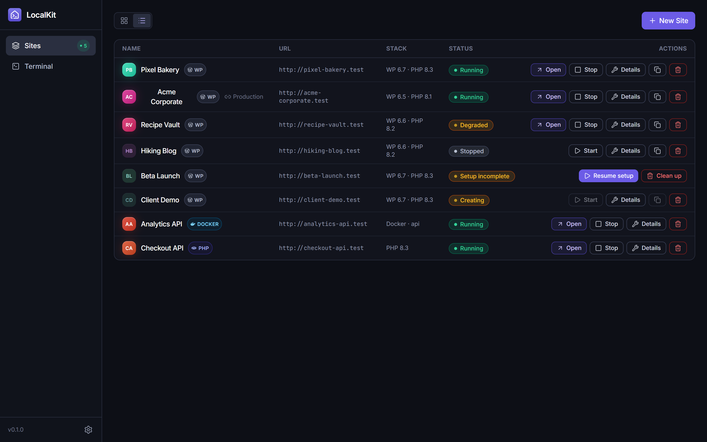
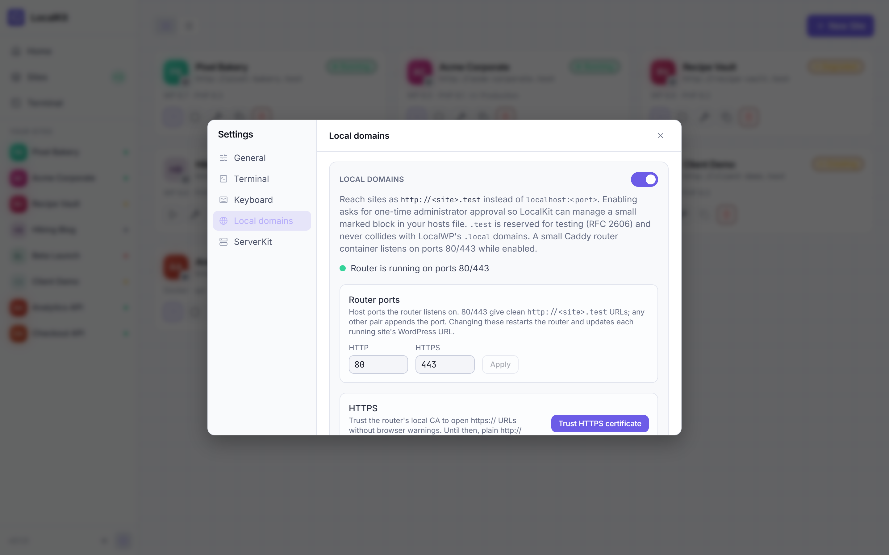

<div align="center">


# LocalKit

**一键启动本地 WordPress 站点。**

一款轻量桌面应用（可以想象成更精简的 LocalWP），将每个 WordPress 站点
作为独立的 Docker Compose 项目运行 —— `wp-content` 直接绑定挂载到
宿主机普通文件夹，你可以用自己熟悉的编辑器修改代码。

[English](../README.md) | [Español](README.es.md) | 中文版 | [Português](README.pt.md)

<br>


[](https://discord.gg/ZKk6tkCQfG)

[](https://github.com/jhd3197/LocalKit/stargazers)
[](https://github.com/jhd3197/LocalKit/releases)
[](../LICENSE)
[](https://github.com/jhd3197/LocalKit/releases)
[](https://tauri.app)
[](https://reactjs.org)

<br>

[快速开始](#-快速开始) · [截图](#-截图) · [功能特性](#-功能特性) · [架构](#-架构) · [路线图](#-路线图) · [文档](#-文档) · [参与贡献](#-参与贡献) · [Discord](#-社区)

</div>

---

## 🚀 快速开始

> ⏱️ 从克隆仓库到运行中的 WordPress 站点，只需几分钟

### 环境要求

- **Docker Desktop**（运行中），Compose v2+
- **Node.js 20+** 和 **Rust**（稳定版，Windows 上使用 MSVC 工具链）—— 仅从源码构建时需要
- 同步功能需要：一台安装了 **`serverkit-localkit` 扩展**的 **[ServerKit](https://github.com/jhd3197/ServerKit)** 服务器

### 开发

```bash
git clone https://github.com/jhd3197/LocalKit.git
cd LocalKit
npm install
npm run tauri dev        # 启动 Vite + Tauri 窗口
```

### 生产构建

```bash
npm run tauri build
```

<!-- LOCALKIT:SHOTS:START -->
## 📸 截图

> 截取自模拟数据构建版本 —— 以下所有站点、凭据和服务器均为虚构。截图清单及使用 `npm run shots` 重新生成的方法请参阅 [`docs/screenshots/CAPTURE.md`](screenshots/CAPTURE.md)。

|                            仪表盘                             |                            列表视图                            |
| :--------------------------------------------------------------: | :------------------------------------------------------------: |
|             |             |
|   _一览所有站点，容器状态徽标实时更新_   |   _站点较多时更紧凑的仪表盘视图_   |

|                             站点详情                              |                           新建站点                            |
| :-------------------------------------------------------------: | :------------------------------------------------------------: |
|                  |           |
| _凭据、wp-cli 信息、ServerKit 同步与历史记录_ | _选择名称、WordPress 版本和 PHP 版本_ |

|                           设置                            |                           本地域名                           |
| :--------------------------------------------------------------: | :-------------------------------------------------------------: |
|                        |            |
|      _Docker 状态、数据路径和 ServerKit 连接_      |     _通过共享 Caddy 路由器以 `http://<slug>.test` 提供站点访问_     |
<!-- LOCALKIT:SHOTS:END -->

## 🎯 功能特性

### 🚀 站点与 Docker

| | |
|---|---|
| **一键创建 WordPress 站点**<br>选择名称、WordPress 版本、PHP 版本 —— 完成。 | **每站点独立 Docker Compose 项目**<br>`wordpress:<wp>-php<php>-apache` + `mariadb:11`，站点间完全隔离。 |
| **自动安装 WordPress**<br>通过 wp-cli 安装，并为你生成管理员凭据。 | **独立主机端口**<br>站点使用 `http://localhost:8081+`，数据库使用 `18081+` —— 互不冲突。 |
| **生命周期与日志**<br>启动 / 停止 / 删除、容器状态实时徽标，以及容器日志查看器。 | **本地域名**<br>可选的 `http(s)://<slug>.test` 域名，由共享 Caddy 路由器在 80/443 端口提供；托管 hosts 文件块（一次性管理员授权），HTTPS 本地 CA 一键信任。 |

### 🔁 ServerKit 同步

| | |
|---|---|
| **推送代码**<br>将本地 `wp-content` 直接推送到 ServerKit 服务器上的远程站点。 | **推送 / 拉取数据库**<br>推送数据库，或将远程数据库拉取到本地站点，自动完成 URL 查找替换。 |
| **同步历史**<br>每次同步操作都会按站点记录，并附带结果。 | **连接管理**<br>保存、测试和删除服务器连接；浏览远程站点并创建新站点 —— 全部通过 `serverkit-localkit` 扩展完成。 |

### 🖥️ 桌面端与 CLI

| | |
|---|---|
| **仪表盘视图**<br>网格视图或紧凑列表视图，重启应用后自动记住。 | **站点详情页**<br>打开站点 / wp-admin、可复制的管理员与数据库凭据、wp-cli 信息（核心版本、插件）。 |
| **`lk` CLI**<br>在终端管理站点：`lk create`、`start/stop/restart`、`wp` 透传、`env` 导出、`doctor`、JSON 输出 —— 与应用共享数据目录。 | **代码绑定挂载**<br>`wp-content` 位于宿主机普通文件夹中，你可以用自己的编辑器修改主题和插件。 |

---

## 🏗️ 架构

```
React frontend (Zustand stores)
        │  invoke / events
        ▼
Tauri commands (src-tauri/src/lib.rs)
        │
        ├─► SQLite (rusqlite, forward-only migrations)
        ├─► docker compose CLI  ──► per-site project dir (compose + .env + wp-content/)
        └─► ServerKit API (reqwest, X-API-Key) ──► serverkit-localkit extension (push/pull)
```

后端直接调用 `docker compose` CLI —— 不使用 Docker API 客户端，无需管理员权限。耗时操作会向 UI 推送 `site-event` 进度事件（`files → containers → waiting → install → done`）。

---

## 🖥️ `lk` CLI

无界面的配套二进制程序，与应用共享数据目录和数据库：

```bash
cd src-tauri
cargo run -p lk -- list                 # 或：cargo build -p lk → target/debug/lk
lk create "My Blog"                     # 完整创建站点，打印站点 URL
lk wp my-blog plugin list               # wp-cli 透传
lk env my-blog                          # 可 eval 的导出：eval $(lk env my-blog)
lk doctor                               # 诊断 Docker / compose / 数据目录
lk list --json                          # 机器可读输出
```

---

## 🛠️ 开发

仅前端（脱离 shell 进行 UI 迭代）：

```bash
npm run dev              # Vite，地址 http://localhost:1420
npm run dev:mock         # 使用模拟数据的 Vite，无需 Docker/Tauri（端口 1426）
npm run shots            # 通过无头 Chrome 重新生成 docs/screenshots/*.png
npm run build            # tsc + vite build
```

Rust 后端：

```bash
cd src-tauri
cargo check
cargo build
```

> **Windows 提示：** 如果 PATH 中的 `cargo` 是非 rustup 的 GNU 安装
> （例如来自 chocolatey），并遇到 `dlltool.exe: program not found`，
> 请将 rustup shims 放到最前：`export PATH="$HOME/.cargo/bin:$PATH"`
> （或使用 `rustup run stable cargo check`）。

---

## 📁 目录结构

```
src/                     React 18 + TS + Vite frontend
  lib/ipc.ts             typed wrappers for all Tauri commands (invoke + events)
  lib/types.ts           shared TS types mirroring Rust payloads
  stores/                Zustand stores (nav, sites)
  pages/                 Dashboard (grid + list views), SiteDetail, Settings (modal)
  components/            Sidebar, StatusBadge, CopyButton, NewSiteDialog, icons
  mock/                  fake @tauri-apps/* modules for `vite --mode mock` (screenshots)
src-tauri/               Rust backend
  src/lib.rs             AppState, command registration, app entry
  src/db.rs              rusqlite, forward-only migrations (PRAGMA user_version)
  src/docker.rs          `docker compose` CLI wrapper
  src/site.rs            Site model, lifecycle, compose/env templates
  src/wordpress.rs       wp-cli via `docker compose run --rm wpcli`
  src/router.rs          local domains: shared Caddy router + hosts block + CA trust
  src/serverkit.rs       ServerKit API client (X-API-Key)
  src/sync.rs            push/pull orchestration + sync history
scripts/                 capture-screenshots.mjs (npm run shots), generate-funding-qr.mjs
docs/
  plans/                 ROADMAP.md + numbered implementation plans
  screenshots/           README screenshots + CAPTURE.md
  images/funding/        donation QR codes
```

---

## 📂 数据位置

- 应用数据：`%APPDATA%/LocalKit/`（macOS：`~/Library/Application Support/LocalKit/`，Linux：`~/.local/share/LocalKit/`）
  - `localkit.db` —— 存储站点、连接和同步历史的 SQLite 数据库
  - `sites/<slug>/` —— 每个站点的项目目录：`docker-compose.yml`、`.env`、`wp-content/`（在此编辑代码）
  - `router/` —— 本地域名共享 Caddy 路由器（compose 项目 + 生成的 Caddyfile），仅在启用本地域名时存在

---

## 🔁 ServerKit 同步说明

- 认证方式为 `X-API-Key`（在 ServerKit → API 设置中创建密钥）。
- 连接测试 = 公开的 `/api/v1/system/health` + 针对 `/api/v1/setup-health/account` 的密钥验证 + 用于检测扩展的 `/api/v1/localkit/pair` 探测。
- 所有同步端点都位于 `serverkit-localkit` 扩展中（`/api/v1/localkit/...`）；缺少扩展时，LocalKit 会明确告知缺少什么。
- **推送代码** = `wp-content/` 的内存 tar.gz → multipart POST。**推送数据库** = `wp db export` → multipart POST。**拉取数据库** = 下载转储 → `wp db import` → `wp search-replace` 将远程 URL 替换为本地 URL。
- 每次同步操作都会按站点记录在同步历史中，并附带结果。
- API 密钥以**明文**存储在 LocalKit 的本地 SQLite 数据库中 —— v1 暂时接受，密钥环存储已在路线图中。

---

## 🗺️ 路线图

- **M1 — 本地站点生命周期** ✅ 创建/启动/停止/删除、compose 项目、端口分配
- **M2 — WordPress 安装与详情** ✅ wp-cli 安装、凭据、日志、wp info
- **M3 — ServerKit 连接** ✅ 保存/测试连接、扩展检测、浏览远程站点
- **M4 — 推送 / 拉取** ✅ 推送代码、推送数据库、拉取数据库并改写 URL、同步历史
- **M5 — 发布打磨** ⬜ 安装包、自动更新、API 密钥存入系统密钥环、测试套件
- **M6 — 本地域名** ✅ 通过共享 Caddy 路由器提供 `http(s)://<slug>.test`，托管 hosts 块 + 本地 CA 信任（计划 6）
- **M7 — CLI（`lk`）** ✅ 无界面配套二进制：生命周期、wp 透传、`env`、`doctor`、JSON 输出（计划 7）

完整细节、各计划阶段和构建顺序：[`docs/plans/ROADMAP.md`](plans/ROADMAP.md)。

---

## 📖 文档

| 文档 | 说明 |
|----------|-------------|
| [路线图](plans/ROADMAP.md) | 里程碑、各计划阶段和构建顺序 |
| [截图采集](screenshots/CAPTURE.md) | 截图清单及使用 `npm run shots` 重新生成的方法 |
| [实施计划](plans/) | 按功能编号的实施计划 |

---

## 🧱 技术栈

| 层级 | 技术 |
|-------|------------|
| 应用外壳 | Tauri 2, Rust |
| 前端 | React 18, TypeScript, Vite, Tailwind CSS v3, Zustand |
| 数据库 | rusqlite（内置 SQLite，仅前向迁移） |
| 容器 | Docker Compose CLI（不使用 Docker API 客户端） |
| 同步 | reqwest (rustls) + flate2/tar（同步归档） |

---

## 🤝 参与贡献

欢迎贡献！

```
fork → feature branch → commit → push → pull request
```

---

## 💛 支持 LocalKit

LocalKit 是自由开源软件。如果它为你节省了时间，可以通过以下方式支持它持续发展：

- ⭐ [为仓库点星](https://github.com/jhd3197/LocalKit) —— 零成本，意义重大
- 💖 [GitHub Sponsors](https://github.com/sponsors/jhd3197)
- ☕ [Buy Me a Coffee](https://buymeacoffee.com/jhd3197)

### 💎 加密货币

| | 资产 | 网络 | 地址 |
|:---:|---|---|---|
|  | **USDT** | **TRC-20** · Tron | `TTiCtqLauF1iSW2YGB3b78KmRxRqoLCgeL` |
|  | **USDT / ETH** | **ERC-20** · Ethereum | `0xD13D5355Fa214e8317fea2ff192a065BaeC13527` |
|  | **BTC** | **Bitcoin** | `bc1qatx67n3qxdvuv3arc9j8aytk34f22g02k9c7vr` |
|  | **SOL** | **Solana** | `AWXzqtBEgUfteHPQtDegsZ6D5y57M3GGdKPD8rR7h6xu` |

TRC-20 手续费最低 —— 通常不到一美元 —— 因此是小额捐赠最友好的
选择。ERC-20 的 gas 费可能比捐赠金额本身还高。

<sub>二维码由 [`scripts/generate-funding-qr.mjs`](../scripts/generate-funding-qr.mjs) 在本地生成，编码前会对每个地址进行校验和验证。</sub>

---

## 🔭 相关项目

**[ServerKit](https://github.com/jhd3197/ServerKit)** —— 一款轻量、现代的服务器控制面板，用于管理 Web 应用、数据库、Docker 容器和安全 —— 没有 Kubernetes 的复杂性，也没有托管平台的高昂成本。通过 `serverkit-localkit` 扩展与 LocalKit 搭配使用，可在本地与远程站点之间推送代码、推送/拉取数据库。

**[Faro](https://github.com/jhd3197/faro)** —— 同一作者出品的现代桌面客户端，支持 SFTP、FTP、SSH 和 S3 兼容存储。保存一次服务器，即可在双栏视图中浏览文件，并在同一 SSH 会话上打开终端 —— 还支持拖放传输、单向目录同步和就地编辑。它甚至提供 **Agent Bridge**，让 Claude Code（或任何 MCP 代理）通过你已认证的会话在服务器上执行命令，逐条命令审批，无需共享凭据。

**[DeviceKit](https://github.com/jhd3197/DeviceKit)** —— 统一的 Android 设备集群与测试自动化平台。在一个仪表盘中控制整个设备集群 —— 运行自动化任务、实时投屏、捕捉视觉回归，并借助 AI 分析调试失败。

---

## 💬 社区

[](https://discord.gg/ZKk6tkCQfG)

加入 Discord 提问、分享反馈或获取配置方面的帮助。

---

## 📄 许可证

MIT —— 详见 [LICENSE](../LICENSE)。

---

<div align="center">

**LocalKit** —— 本地 WordPress 开发，轻装上阵。

[报告问题](https://github.com/jhd3197/LocalKit/issues) · [功能建议](https://github.com/jhd3197/LocalKit/issues)

由 [Juan Denis](https://juandenis.com) 用 ❤️ 制作

</div>
